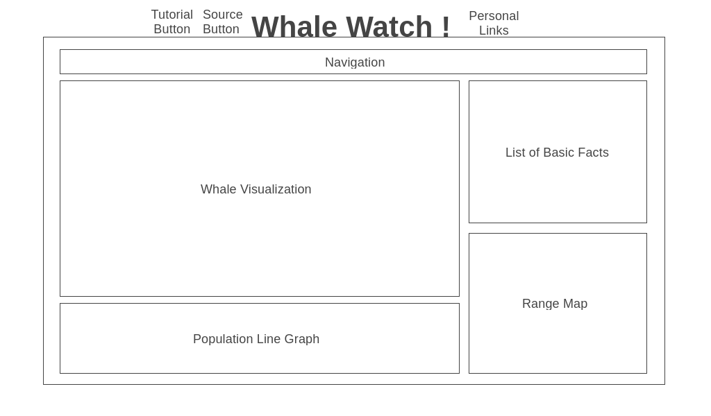

# Whale Watch!

Description: 

[Whale Watch](https://ashleyjek.github.io/WhaleWatch/) is data visualization module showcasing facts about whales categorized by species. The data is presented through interactive visuals and features that will allow the user to navigate between different tabs. Each tab holds one of six species, that will allow the user access unique details. The project aims to provide informative and visually captivating insights into the diversity and significance of whales while spreading awareness on whale endangerment.

Tutorial Modal:

Wireframe:

Functionality & MVPs:

* Each tab will dynamically render information on each species.

* Visualize the decrease in population through a line graph implemented using chart.js
  

Technologies, Libraries, APIs:

* Chart.js
* Webpack
* NPM

Implementation Timeline:

* Thursday/Friday - Set up skeleton, researched ways to execute project, started on CSS (background, header, and main body template).

* Friday - Focused on implementing code to ensure correct info is rendered based on active tab.

* Saturday/Sunday - Added region maps, implemented line graphs using chart.js, and finished basic facts sections.

* Monday - Incorporated whale illustrations and included a toggle feature to map to switch between text and map. 

* Tuesday - Worked on including personal links, audio, and fixed GitHub deployment to correctly render all images.

* Wednesday - Completed tutorial/source modals and made finishing touches to CSS.

* Thursday - Deployed to GitHub.

Future Implementation:

* An interactive feature to the illustrations to better depict the size difference between the species in comparison to other objects/animals. 

* Add more facts about each species such as diet or unique physical characteristics that will allow the user to differentiate between species.

